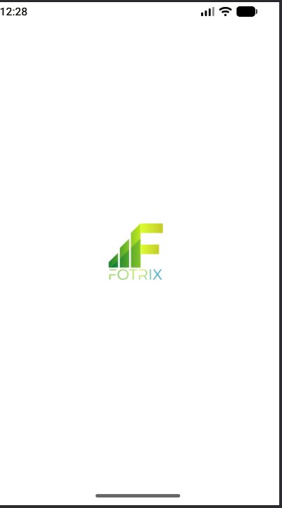
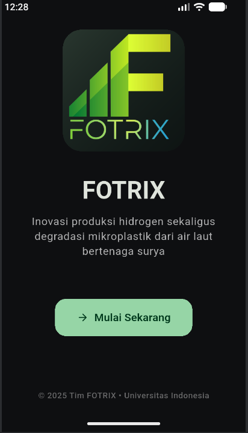
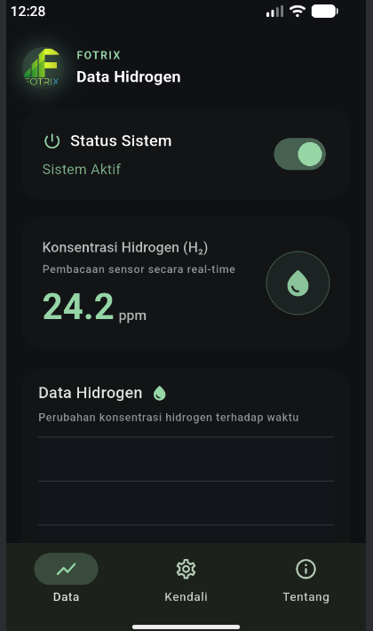
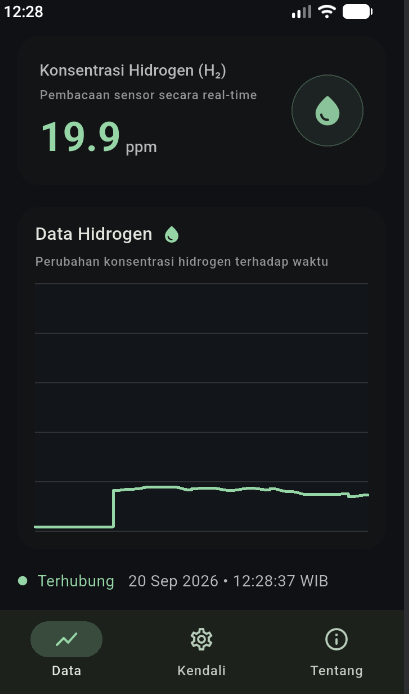
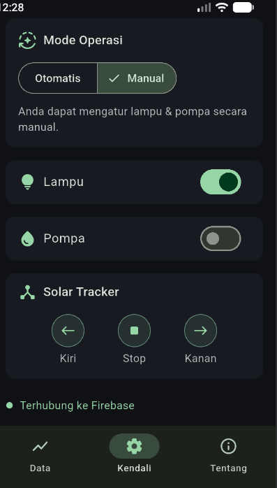
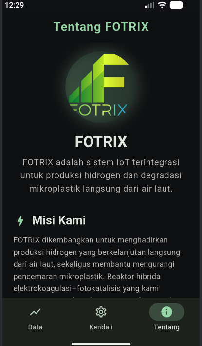

# Fotrix — Hydrogen Monitor

A Flutter control app for FOTRIX — a hybrid electrocoagulation–photocatalysis reactor built by Tim FOTRIX (Universitas Indonesia, PKM program) that produces hydrogen and degrades microplastics from seawater, powered by solar energy. The app is the reactor's operator dashboard: live-ish sensor readout, device control over Firestore, and a mission/safety/credits screen.

| Splash | Startup | Data |
|---|---|---|
|  |  |  |

| Data — connected | Control | About |
|---|---|---|
|  |  |  |

*Screenshots from a real device, real Firebase project.*

## Screens

- **Splash** — native Flutter launch splash (white, FOTRIX mark)
- **Startup** (`screens/startup_page.dart`) — first-run intro flow, gated by `shared_preferences`
- **Data** (`screens/data_page.dart`) — hydrogen concentration (ppm) readout and a live chart (`widgets/line_chart.dart`). **This screen is a local simulation, not a live sensor feed**: a `Timer.periodic` generates a random-walk value while the "Status Sistem" toggle is on. It doesn't read Firestore or any device — it's built to look and behave like the real telemetry screen will once the physical sensor pipeline lands.
- **Control** (`screens/control_page.dart`) — this one *is* real: writes `systemOn`/`lampOn`/`pumpOn`/`roofOn`/`trackerCommand` to the `devices/fotrix1` Firestore document (merge writes), meant to be read by the reactor's controller (ESP or similar) on the other end. Toggles for lamp/pump, Otomatis/Manual mode, and left/stop/right solar-tracker buttons.
- **About** (`screens/about_page.dart`) — mission statement, pre-run/post-run safety checklist, and team credits (see note below on photos)

## Stack

Flutter · Firebase Core · Cloud Firestore · `shared_preferences` (first-run state)

## Setup

1. `flutter pub get`
2. Create a Firebase project, enable Firestore, and download your own `google-services.json` for an Android app
3. Copy `android/app/google-services.json.example` → `android/app/google-services.json` and fill in your project's values
4. Publish Firestore rules that actually allow access — a fresh project's default test-mode rule expires 30 days after creation and starts rejecting everything with `permission-denied`. This app has no login flow, so either keep extending that date or use `allow read, write: if true;` for a personal dev project.
5. `flutter run`

Android only — no iOS/web/desktop platform folders were generated for this project.

## Notes

- **Team photos excluded.** `screens/about_page.dart` references five team-member photo assets (`assets/<name>.jpg`, `assets/<name>1.jpg`) that are **not** included here — publishing other people's photos to a public repo needs their say-so first, not just yours. The logo assets (`LogoPKM.png`, `Logonobg.png`) are kept. Add the photos back locally, or swap in placeholder avatars, before you rely on that screen. The About screenshot above only shows the mission section (above where the team photos would scroll into view) for the same reason.
- **Android package ID left as-is.** The app was never renamed off the Flutter default (`com.example.untitled2` in `AndroidManifest.xml`/`build.gradle.kts`/`MainActivity.java`). Left untouched here rather than doing an untested rename — rename it (package id, `MainActivity` path, `google-services.json` package name to match) before shipping to the Play Store.
- The real `google-services.json` is excluded from version control via `.gitignore`; only the redacted `.example` template is committed.
- Source synced from the live project at `D:\Dev\Flutter Projects\untitled2` (its actual working folder — `fotrix.zip` was an earlier, slightly stale backup of the same project).
